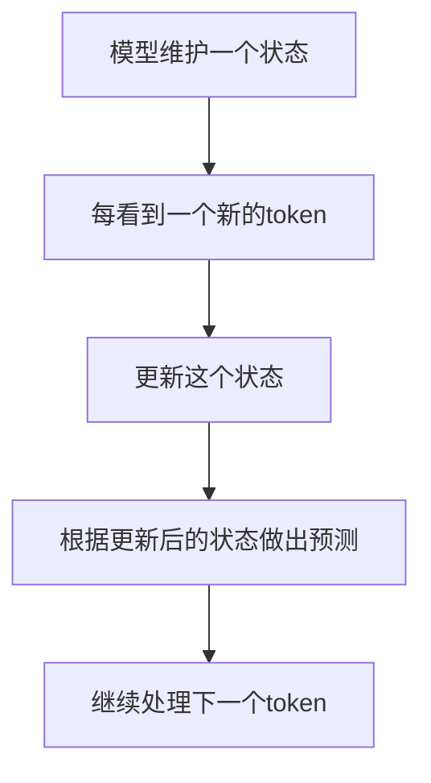
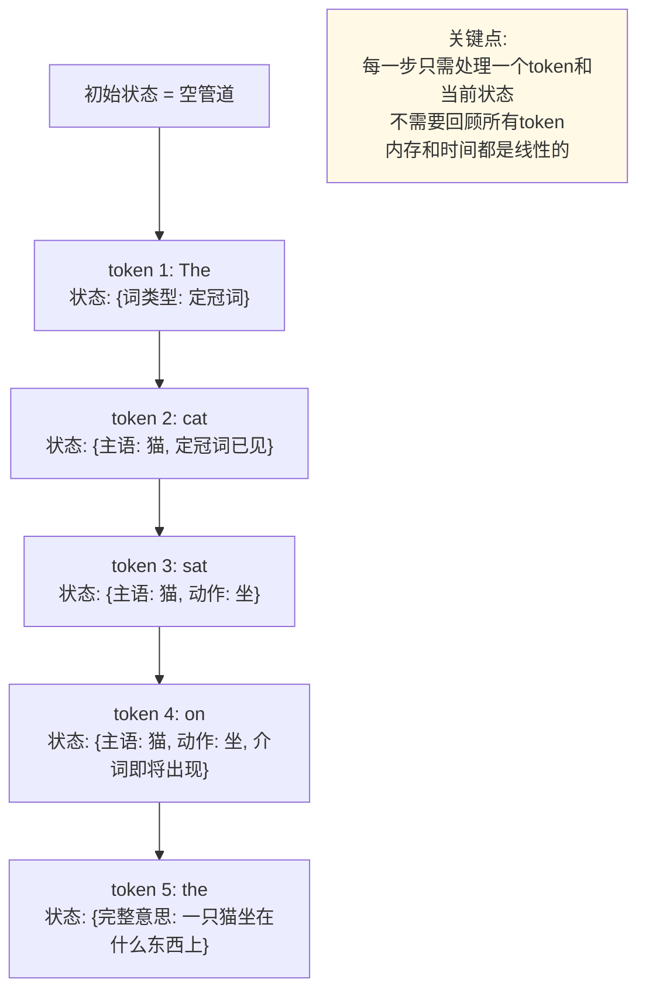
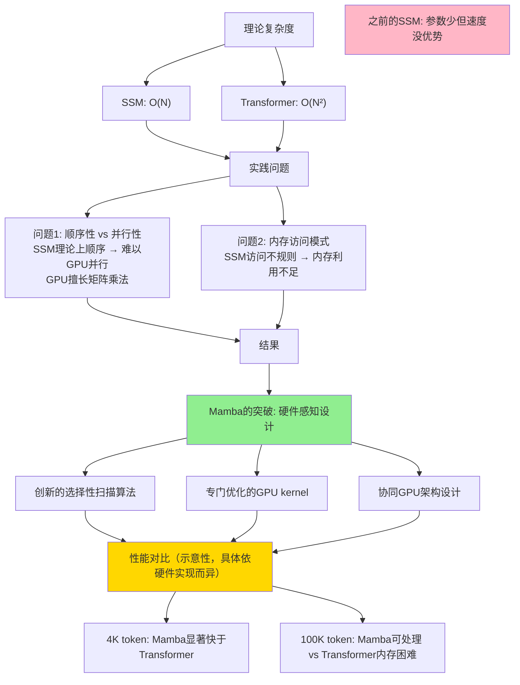
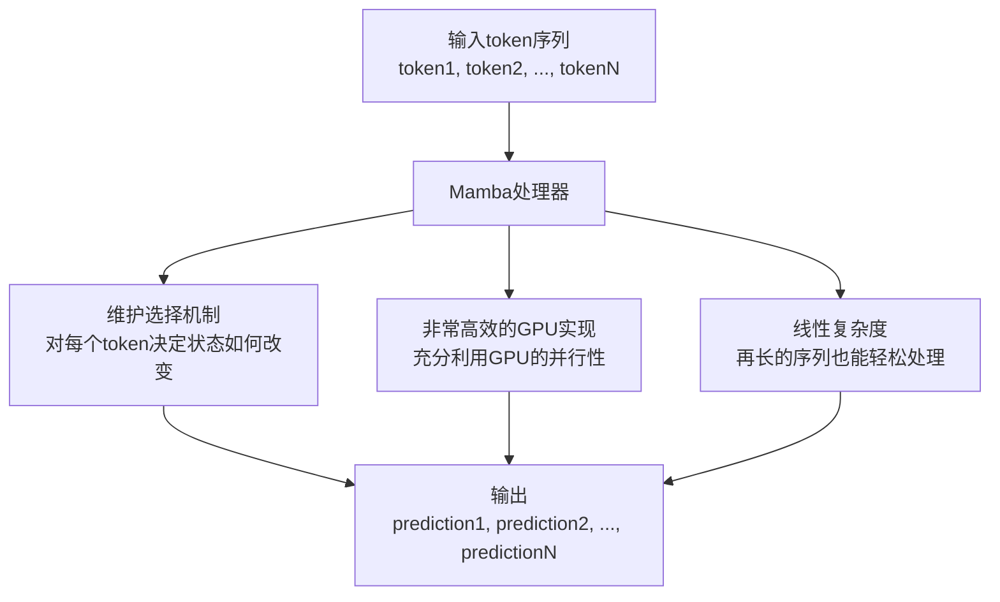
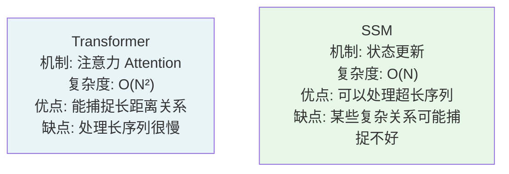

## 8.2 状态空间模型入门

> 用自来水管的类比理解 SSM 如何替代注意力机制

### 8.2.1 什么是状态空间模型？

首先，别被名字吓住。“状态空间模型”听起来很复杂，但核心思想其实很简单：



这就是全部。没有注意力，没有复杂的矩阵乘法。只是不断更新一个状态。

### 8.2.2 类比 1：自来水管

想象一个自来水管系统：

```text
传统的"注意力"管道：
所有的水龙头都连接到一个中央枢纽
每个水龙头都需要与所有其他水龙头通信
水龙头数量增加 → 中央枢纽变得极其复杂

缺点：如果有100个水龙头，需要100×100的连接点！

─────────────────────────────────────

SSM管道：
水从上游流下来 → 通过一系列的管道 → 流向下游
每个节点只需要：
  • 接收来自上游的水
  • 向其中加入一点"处理"
  • 把结果传给下游

优点：无论有多少个节点，都是线性的连接！
```

### 用管道类比 SSM 如何工作



### 8.2.3 类比 2：河流与河床

```text
Transformer的注意力机制：
所有的水分子都需要互相比较权重
你有1000个水分子 → 需要比较1,000,000次

SSM的方式：
水流沿着河道向下
河床（状态）被水流塑造和改变
新的水分子到来时，河床给予它"方向"

关键：河床记住了"历史"，但不需要逐个比较每一滴水
```

### 8.2.4 与本章其他部分的关系

📖 **相关内容**：
- 本章第 8.1 节介绍了为什么我们需要超越 Transformer
- 本章第 8.3 节展示了如何将 SSM 与 Transformer 混合使用
- 本章第 8.4 节讨论 SSM 如何支持更长的上下文（这对第 12.5 节的上下文工程很重要）

### 8.2.5 状态是如何“记忆”的？

这是 SSM 最巧妙的地方。如果没有注意力机制，SSM 如何记得之前的信息？

答案是：**通过状态中的隐藏维度**

```text
SSM维护的状态是一个向量：

状态 = [维度1, 维度2, 维度3, ..., 维度D]

这个向量中的每个维度可以编码不同的信息：

维度1可能编码：前面是否出现过名词
维度2可能编码：前面的句子是陈述还是疑问
维度3可能编码：当前主语是单数还是复数
...
维度D可能编码：...（数百个这样的特征）

当一个新token到来时：
旧状态 + 新token → 新状态

这个转换保留了旧状态中的重要信息（需要的会保留）
并融合了新token的信息。

结果：虽然没有显式的"注意力"，但状态中却编码了必要的历史信息。
```

### 类比：棋局的记忆

```text
棋手在思考时：

Transformer的方式：
需要分析所有之前下过的棋子，
计算每一步对当前局面的影响
1000步棋 → 需要分析1,000,000次棋子对

SSM的方式：
棋手的大脑维护一个"局面理解"
看到新的一步棋时，更新这个理解
不需要重新分析所有历史棋步

棋手的大脑中的"理解"就像SSM的状态：
- 包含了历史信息的浓缩版本
- 足以做出好的判断
- 但不需要逐步回顾所有历史
```

### 8.2.6 Mamba：最重要的 SSM 实现

2023 年底，一个团队（来自 CMU 和 Princeton）发布了 Mamba，这是第一个真正有竞争力的 SSM 实现。

### Mamba 为什么重要？

之前，SSM 理论上很好，但实际运行并不比 Transformer 快。原因是：



### Mamba 的名字含义

“Mamba”是一种快速的蛇。名字暗示：快速、敏捷的数据处理。



### 8.2.7 SSM vs Transformer：基本对比



### 8.2.8 实际场景中的应用

### SSM 擅长的任务

```text
✓ 非常适合用SSM：

1. 长文本处理
   - 处理整个论文、书籍
   - SSM的线性复杂度是游戏改变者

2. 流式数据处理
   - 实时日志分析
   - 连续的传感器数据
   - SSM天生适合流式输入

3. 持久上下文
   - 在一个长对话中保持一致性
   - 记住数小时前的信息
   - SSM的状态可以不断更新

✗ SSM可能不如Transformer的任务：

1. 需要捕捉复杂长距离依赖
   - 某些数学推导
   - 复杂的逻辑推理
   - 注意力机制在这里可能更好

2. 需要"往回看"
   - Transformer可以轻松关注之前的任何地方
   - SSM只能通过状态间接关注
```

### 8.2.9 本节小结

状态空间模型是一个完全不同的思考方式：
- **不是** 计算每个 token 对所有其他 token 的影响
- **而是** 维护一个不断进化的“理解状态”

主要优势：
- 线性而不是二次的复杂度
- 能处理超长的序列
- 可以自然地处理流式数据

主要挑战：
- 某些任务上可能不如 Transformer 强
- 还没有多年的工程优化积累
- 学术界仍在探索如何最好地设计 SSM

### 8.2.10 思考题

1. 如果 SSM 这么好，为什么之前没有人广泛使用？

2. 你能想到其他领域（不是 AI）中，线性方法优于二次方法的例子吗？

3. 如果一个 SSM 模型说“我不确定这个答案”，它的不确定性来自哪里？（提示：没有显式的注意力）
