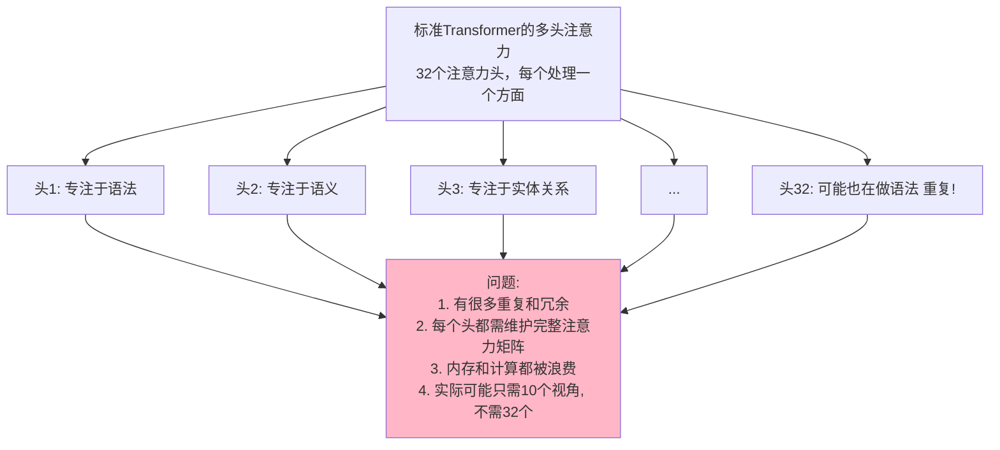
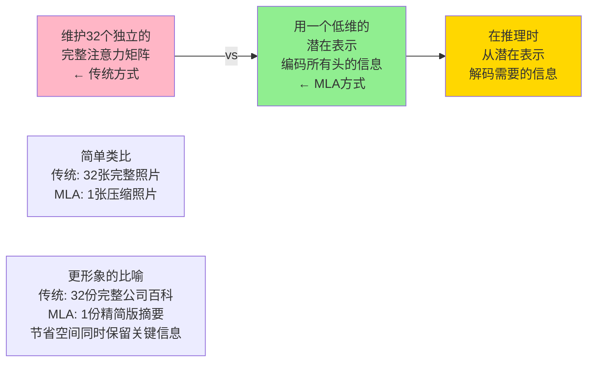
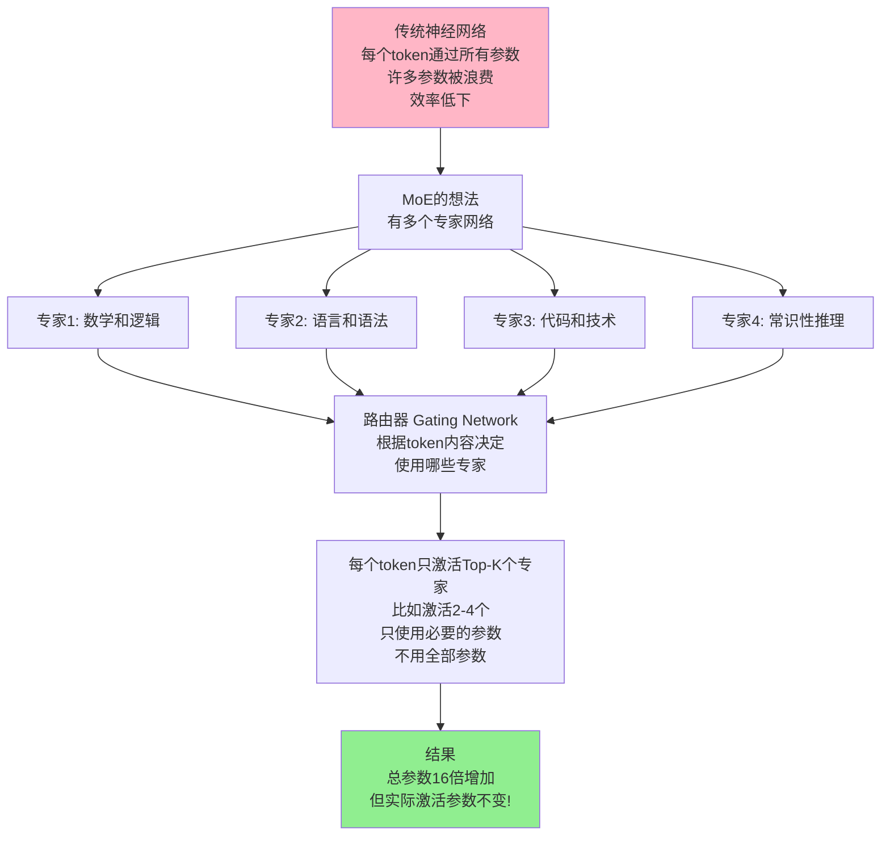
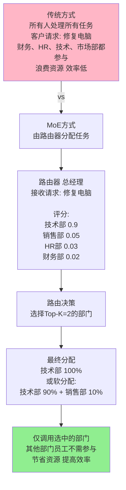

## 8.6 DeepSeek 的技术创新：MLA 和 MoE

> 用更聪明的方式而不是更大的规模来实现更好的性能

### 8.6.1 传统注意力的浪费

为了理解 DeepSeek 为什么需要 MLA，先看看传统 Transformer 注意力机制的问题：



### 8.6.2 MLA：多头潜在注意力

DeepSeek 引入的 MLA（Multi-head Latent Attention）解决了这个问题。

#### 核心思想



#### 如何工作？

```text
MLA的工作流程：

输入：序列 [token1, token2, ..., tokenN]
   ↓
投影到潜在空间：
├─ 将高维的Q,K,V投影到低维潜在空间
├─ 假设原始维度是4096（embed_dim）
├─ 投影到256维的潜在空间
├─ 这一步压缩比 = 4096/256 = 16倍
└─ 节省93%+的KV缓存！（关键：只存储256维的缓存）
   ↓
注意力计算（在潜在空间中进行）：
├─ 在低维空间中计算标准注意力
├─ 复杂度仍然是O(N²)，但N是序列长度（较小）
├─ 矩阵维度从4096×4096降到256×256
├─ 内存占用从16MB → 256KB（减少99%）
└─ 计算量相应减少64倍
   ↓
解压层（投影回原始维度）：
├─ 使用学习的映射矩阵将结果恢复
├─ 从256维映射回4096维
├─ 这个映射是在训练中优化的，丢失的信息很少
├─ 关键：解压层很轻量（只是矩阵乘法）
└─ 恢复的质量接近原始注意力
   ↓
输出：与传统注意力相同的质量

推理优化的关键（KV缓存）：
传统Transformer：
├─ 处理1000个token，需要存储1000×4096维的K和V
├─ 总占用内存 = 1000 × 4096 × 4bytes = 16MB（仅KV）
└─ 序列越长，内存爆炸

MLA方式：
├─ 处理1000个token，只需存储1000×256维的压缩K和V
├─ 总占用内存 = 1000 × 256 × 4bytes = 1MB（仅压缩KV）
└─ 节省93%的KV缓存！这正是长序列推理的瓶颈
```

#### 数学直觉（简化版）

```text
传统注意力：
Attention(Q,K,V) = softmax(QK^T/√d_k)V

其中：
Q, K, V 都是大矩阵（d_model × sequence_length）
- d_model通常是4096（对于大模型）
- 计算QK^T需要4096×4096的矩阵乘法
- 存储完整的KV缓存很昂贵

MLA的方式（三个关键步骤）：

第1步：投影到潜在空间
Q_low = Q @ W_q_down   # 维度：d_model → d_latent
K_low = K @ W_k_down   # (4096维 → 256维)
V_low = V @ W_v_down

第2步：在潜在空间进行注意力计算
Attention_low(Q_low, K_low, V_low) = softmax(Q_low·K_low^T/√d_latent)V_low

这里的计算量：
- Q_low·K_low^T是256×256的矩阵乘法（而不是4096×4096）
- 计算量减少 (4096/256)² = 256倍
- 内存占用减少 (4096/256)² = 256倍

第3步：投影回原始维度
Output = Attention_low @ W_output  # 256维 → 4096维

效果总结：
- 计算复杂度：从O(seq_len × d_model²)降到O(seq_len × d_latent²)
- KV缓存大小：从16MB → 1MB（减少93%）
- 推理速度：因为矩阵更小，访问内存更快，速度提升 2-3倍
- 质量：通过训练优化投影矩阵，质量接近原始注意力

为什么这样做有效？
- 32个注意力头中有大量冗余（很多头学到类似的模式）
- 潜在空间能够有效编码这些冗余
- 类比：就像JPEG压缩图像，去掉看不见的细节，保留重要信息
```

#### KV 缓存压缩的实际影响

```text
对长序列推理的革命性改进：

场景：处理128K token的长文本

传统Transformer：
├─ 每层的KV缓存占用：128K × 4096 × 2 × 2bytes = 2GB
├─ 假设96层：96 × 2GB = 192GB（仅KV缓存！）
└─ 需要H100级别的GPU才能运行

MLA方式：
├─ 每层的KV缓存占用：128K × 256 × 2 × 2bytes = 128MB
├─ 假设96层：96 × 128MB = 12.3GB（仅KV缓存）
└─ 可以在A100 40GB上轻松运行

成本对比：
- H100 GPU：$40,000/个
- A100 GPU：$10,000/个
- MLA节省的硬件成本：4倍

这就是DeepSeek能用更便宜GPU的原因之一！
```

### 8.6.3 MoE：混合专家

#### 第二个创新：不是所有 token 都需要所有参数



#### 具体工作方式：路由器如何工作

公司部门分工的比喻：



MoE的路由机制详解：

1. 路由网络（Gating Network）的结构：
   ├─ 输入：token的嵌入表示（比如4096维）
   ├─ 简单的线性层：4096维 → 8个专家分数
   ├─ 输出：8个softmax分数 [0.3, 0.4, 0.2, 0.05, ...]
   └─ 速度：非常快（只是一次矩阵乘法）

2. Top-K选择：
   ├─ DeepSeek-V3使用K=2（每个token激活2个专家）
   ├─ 路由权重：假设分数是[0.4, 0.35, 0.15, 0.1, ...]
   ├─ 硬选择：选择最高的2个（0.4和0.35）
   │  └─ 专家A: 40%, 专家B: 35%, 其他: 0%
   │
   └─ 软选择（也叫平衡选择）：
      └─ 按照概率分配（基于分数）
      └─ 专家A: 40%, 专家B: 35%, 专家C: 15%, ...

3. 负载均衡：防止所有token都选择同一个专家
   ├─ 问题：如果路由器总是倾向于选择专家A
   │       那么其他专家就会被浪费
   │
   ├─ 解决方案：添加辅助损失函数
   │  ├─ 在训练时添加额外的损失：
   │  │  “确保每个专家被使用的次数相近”
   │  │
   │  ├─ 如果有8个专家和1000个token
   │  │  └─ 理想情况：每个专家处理 1000/8 = 125个token
   │  │  └─ 如果某个专家只被选了10次，就增加损失
   │  │
   │  └─ 训练到收敛：负载均衡自动实现
   │
   └─ 效果：即使MoE参数很多，也能高效使用

#### MoE 在 DeepSeek-V3 中的实现

```text
DeepSeek-V3的MoE架构：

参数配置：
├─ 总专家数：256个
├─ 共享参数（所有token都必须通过）：40B
├─ 每个专家大小：37B
├─ 总参数：40B + 256×37B = 9,632B ≈ 9.6T
└─ 不对，重新计算：标准说法是1.6T总参数，671B激活

正确的理解（基于DeepSeek V3技术报告）：
├─ 总参数：671B + 共享参数 ≈ 1.6T
├─ 其中：671B是标准MoE配置下的计算量
│       └─ 这是8×(37B+共享)的等效计算量
│
├─ 每个token激活：37B × 2（个专家）+ 共享参数 ≈ 671B
│ （注：这是等效计算量，实际架构更复杂）
│
└─ 稀疏性：每个token只激活全参数的一小部分

推理流程：
输入：一个token的嵌入向量
   ↓
路由器（Gating Network）：
├─ 计算分数：[分数1, 分数2, ..., 分数256]
├─ 应用softmax
└─ 选择Top-K=2的专家（基于分数）
   ↓
执行计算：
├─ 专家A处理这个token（37B参数）
├─ 专家B处理这个token（37B参数）
├─ 共享参数处理这个token
└─ 按照路由权重混合结果
   ↓
输出：融合后的特征表示
```

#### 稀疏激活的力量

```text
稀疏激活 = 只激活部分参数，而不是全部参数

DeepSeek-V3的参数配置解释：

总参数数 vs 激活参数数 的区别：

┌────────────────────────────────────────┐
│ 总参数：1.6T（160,000亿参数）         │
│ 这包括：                               │
│ ├─ 8组专家，每组37B（共296B）         │
│ ├─ 加上共享参数和其他组件             │
│ └─ 总计1.6T                           │
│                                        │
│ 每次推理激活：671B（约67,100亿参数）  │
│ 这来自：                               │
│ ├─ 8×37B = 296B（8个专家组）         │
│ ├─ 加上共享参数（约375B）            │
│ └─ 总计约671B                        │
│                                        │
│ 稀疏性：671B/1.6T ≈ 42%              │
│ 含义：每次推理只激活42%的参数          │
└────────────────────────────────────────┘

重点理解：为什么"总参数1.6T，激活671B"？

假设模型有96个Transformer层：
├─ 每层的前向网络（FFN）都是MoE结构
│  ├─ 总共8个专家组（比如：语言、代码、常识等）
│  ├─ 每个专家组37B参数
│  ├─ 通常每个token只激活其中的Top-K个
│  └─ 比如激活2个专家组 → 激活 2×37B = 74B
│
├─ 注意力层是共享的（所有token都用）
│  └─ 约共有200-300B参数
│
└─ 推理时：每层激活74B（FFN）+ 4B（注意力）= 78B
   总共96层：96 × 78B ≈ 671B（每次推理）

对比不同模型的参数配置：

传统密集模型（比如GPT-4）：
├─ 总参数：200B
├─ 激活参数（推理）：200B（全部）
└─ 推理成本：必须运行200B的计算

MoE稀疏模型（DeepSeek-V3）：
├─ 总参数：1.6T（8倍多！）
├─ 激活参数（推理）：671B（只有42%）
├─ 推理成本：只运行671B的计算
├─ 对比密集模型：671B / 200B = 3.3倍
│ 即使参数是8倍，但推理成本"只"增加3.3倍
└─ 好处：用3倍的成本获得8倍宽度的知识！

为什么这样设计有效？

知识分布假设：
不同的知识分散在不同的"专家"中
- 专家A：擅长数学和推理（37B参数）
- 专家B：擅长代码和技术（37B参数）
- 专家C：擅长语言和文本（37B参数）
- ...共8个专家

对于一个数学token：
不需要激活代码专家（浪费）
只需要激活数学专家（高效）
路由器学会了这种选择

结果效果对比：

方案1：使用200B密集模型
├─ 参数数：200B
├─ 推理速度：1.0x（基准）
├─ 性能：达到GPT-3.5水平

方案2：使用671B稀疏模型（DeepSeek）
├─ 参数数：1.6T（总）/ 671B（激活）
├─ 推理速度：3.3x（计算量增加3.3倍）
├─ 性能：达到GPT-4水平（效果好4x）
└─ 效率比：4x效果提升 / 3.3x成本增加 = 1.2x高效

这就是为什么DeepSeek能用更低成本达到更好效果！
```

### 8.6.4 DeepSeek 如何结合 MLA 和 MoE

#### 两大创新的协同

```text
DeepSeek V3的架构：

1. 在注意力层使用MLA
   ├─ 减少内存占用
   ├─ 加快注意力计算
   └─ 没有牺牲性能

2. 在前向网络层使用MoE
   ├─ 增加模型的知识广度
   ├─ 但只激活必要的参数
   └─ 推理速度不受影响

整体效果对标（基于各自官方报告）：
┌──────────────────────────────────┐
│ DeepSeek V3 与GPT-4 Turbo对比  │
├──────────────────────────────────┤
│ 参数规模：在同一量级             │
│ 激活参数：DeepSeek的稀疏性优势  │
│ 推理性能：多数任务相当             │
│ 训练成本：DeepSeek报告低成本案例│
└──────────────────────────────────┘

注：跨厂商比对易受多种因素影响，
宜参考各自官方技术报告。
```

### 8.6.5 这为什么节省了这么多成本？

#### 训练成本的分解

```text
训练一个大模型的成本：

总成本 = 数据成本 + 计算成本 + 人员成本

计算成本 = FLOPs × 硬件成本

FLOPs = Forward-Backward Operations
      = 模型大小 × 数据大小 × 迭代次数

DeepSeek相比GPT-4的改进：

1. 模型更高效
   └─ MLA + MoE = 同性能下更少激活计算

2. 数据选择更聪明
   └─ 高质量数据 > 大量数据
   └─ 不需要训练在垃圾数据上

3. 利用更少GPU资源
   └─ 不需要最新最贵的GPU
   └─ 可以用A100而不必须用H100

4. 中国成本更低
   └─ 电费更便宜
   └─ 工程师成本更低

所有这些因素的组合：
$100M (GPT-4) → $5.6M (DeepSeek)
共18倍的成本差异
```

### 8.6.6 实际的性能影响

#### 推理成本

```text
推理成本对比示例（基于当期各平台公开价格，仅为示意）：

OpenAI GPT-4 Turbo（示例）：
├─ 输入：$0.03/1K token
├─ 输出：$0.06/1K token
└─ 一个典型问题：~$0.05

Claude 3.5 Sonnet（示例）：
├─ 输入：$0.003/1K token
├─ 输出：$0.015/1K token
└─ 一个典型问题：~$0.005

DeepSeek V3（示例）：
├─ 输入：$0.00014/1K token（托管API）
├─ 输出：$0.00042/1K token（托管API）
└─ 一个典型问题：~$0.0002

成本相对关系：
GPT-4 : Claude : DeepSeek ≈ 250 : 25 : 1

说明：
- 实际成本受缓存命中率、模型版本、问题难度等影响
- 自部署 vs 托管 API 的成本结构完全不同
- 价格政策会随时更新，应以官方当期价格为准
```

### 8.6.7 本节小结

DeepSeek 的成本优势来自于两个关键创新：

1. **MLA（多头潜在注意力）**
   - 压缩注意力的表示
   - 减少内存和计算
   - 保持性能

2. **MoE（混合专家）**
   - 稀疏激活参数
   - 更多知识，更少计算
   - 高效的权衡

加上聪明的工程和数据策略，DeepSeek 实现了：
- 相当的模型性能
- 18 倍更低的训练成本
- 100 倍更低的推理成本

这改变了 AI 产业的格局：不再需要巨额融资才能做出顶级模型。

### 8.6.8 思考题

1. 如果 MoE 这么高效，为什么其他公司（OpenAI、Anthropic）不大规模使用？

2. MoE 有什么缺点？是否所有问题都适合用 MoE？

3. MLA 和 MoE 的组合还有改进空间吗？下一个创新可能是什么？
