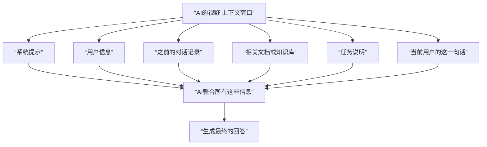
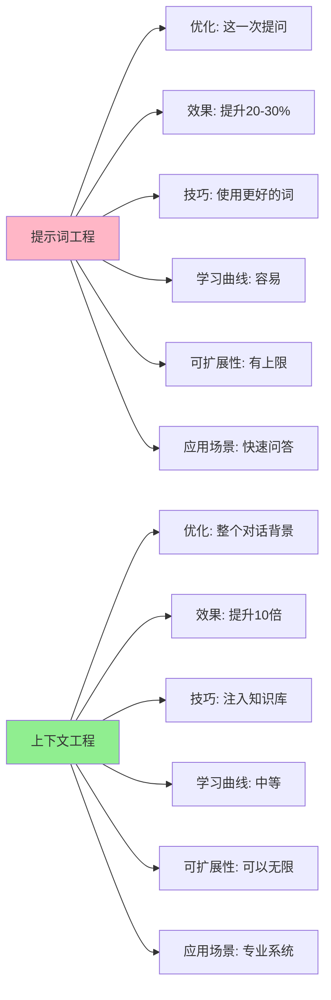

## 12.5 上下文工程：AI 时代的基本素养

> 同样的问题，不同的上下文，AI 给出完全不同的答案

### 12.5.1 一个真实的例子

想象你问 ChatGPT：“推荐一部电影”。

AI 的回答可能很普通：《肖申克的救赎》、《楚门的世界》之类。

但如果你告诉 AI：
- “我的工作是医生，每天都很疲惫”
- “我喜欢看需要大脑思考的电影”
- “我不喜欢暴力镜头”
- “我最近看了《盗梦空间》和《记忆碎片》”
- “我的假期只有 3 小时”

突然，AI 给出的推荐就完全不同：《心灵捕手》（有医学背景，需要思考，平静）、《时间规划局》（需要思考，适合短时间观看）。

这两个例子中，**提示词只是“推荐一部电影”**，但**上下文** 完全不同，所以答案也不同。

### 12.5.2 什么是上下文？

上下文（Context）= AI 做决定时能看到的所有信息



关键洞察：
- 当前的一句话（提示词）其实占比很小
- AI 真正看重的是整个背景信息

> 💡 关于上下文工程的完整介绍，请参阅《上下文工程指南》。

### 12.5.3 为什么上下文工程这么重要？

#### 理由 1：人类也是这样工作的

想象你去看医生：

情景 A：医生什么都不知道，只听你说“我很累”
- 医生会很困惑
- 可能建议：多休息
- 正确性：50%

情景 B：医生知道你的完整医疗史、工作压力、生活方式
- 医生能做出准确判断
- 可能发现潜在疾病
- 正确性：95%

**同样的问题，上下文的差异决定了答案的质量。** AI 也是如此。

#### 理由 2：AI 的关键限制是上下文窗口

不同 AI 模型的上下文窗口大小差异很大。这个窗口大小决定了你能一次性喂给 AI 的信息量。必须精心设计这个有限的上下文，让 AI 在这个限制下做出最好的决定。

### 12.5.4 上下文的三个层次

#### 第一层：对话上下文

```text
最简单的上下文：之前的对话记录

你：3乘以5是多少？
AI：15

你：再乘以2？
AI：30（理解了"再"指的是上一个结果）

如果没有对话上下文，AI就不理解你的"再"。
```

这是现有 AI 工具都支持的。

#### 第二层：知识库上下文

```text
把你的知识喂给AI

你的公司手册 → 向量数据库 → AI在回答时搜索相关部分 → AI基于这些部分回答

例子：
用户问："我们的休假政策是什么？"

没有RAG：AI可能说"我不知道"或基于通用知识瞎说

有RAG：
1. 搜索公司手册中"休假"相关的部分
2. 找到："员工每年享受20天带薪假期"
3. AI精确回答

结果：答案从"不知道"变成"精确回答"
```

#### 第三层：系统集成上下文

```text
让AI实时访问外部系统

没有MCP：
用户："我的日历有什么安排？"
AI："我看不到你的日历"

有MCP（Model Context Protocol）：
用户："我的日历有什么安排？"
AI：[调用MCP接口] → [查询Google Calendar]
    → "你下午3点有个与张三的会议"

AI不再是"知道"的东西，而是能"看到"实时信息
```

### 12.5.5 上下文 vs 提示词：根本区别



### 12.5.6 实际效果对比

#### 例子 1：代码生成

**只用提示词：**
```text
提示词："用Python写一个快速排序"

结果：获得教科书级的通用快速排序
问题：
- 不符合你的代码风格
- 不包含你项目的特定需求
- 需要大量修改
```

**用上下文工程：**
```text
上下文：
1. 系统提示："你是我的代码助手，熟悉我的项目风格"
2. 我的编码规范（15行）
3. 我项目的现有代码（200行）
4. 这个函数需要与之集成的代码

提示词："用Python写一个快速排序"

结果：生成的代码
- 符合我的风格
- 完美集成到项目中
- 基本不需要修改
```

效果差异：提示词工程需要修改 80%的代码，上下文工程只需修改 5%。

#### 例子 2：论文写作助手

**没有上下文：**
```text
用户："帮我写一篇关于AI的论文"
AI："AI是...（很通用的内容）"
```

**有上下文：**
```text
上下文：
1. 论文的标题和摘要
2. 已有的研究背景（3页）
3. 期刊的格式要求
4. 你以前写过的2篇论文（作为写作风格参考）
5. 相关的研究文献列表

提示词："帮我完成第3章"

结果：
- 风格与你之前的论文一致
- 引用格式正确
- 深度和专业性符合期刊要求
- 逻辑与前面章节连贯
```

#### 例子 3：客服机器人与知识库

**没有上下文的客服 AI：**
```text
用户："我的订单为什么还没发货？"
AI："您可以到订单页面查看物流信息..."（通用回答）

问题：
- 不知道用户的订单状态
- 不知道公司的配送政策
- 不知道当前是否有库存问题
- 可能无法解决用户的实际问题
```

**有 RAG 上下文的客服 AI：**
```text
上下文：
1. 用户账号的订单历史和详细信息
2. 当前订单的物流跟踪数据（实时）
3. 公司常见问题库和配送政策文档
4. 当前库存和发货状态
5. 用户之前的投诉和解决方案

提示词："我的订单为什么还没发货？"

AI的实际回答：
"您的订单（编号#12345）已于1月15日确认。
由于2024年末高峰期，当前配送周期为7-10个工作日。
预计发货时间：1月20日。
如需加急，我们提供次日达服务（额外$5）。
您之前对订单#11234也等待过发货，那一次最终提前1天到达。"

效果：具体、有针对性、能解决问题
```

#### 例子 4：法律文档分析助手

**没有上下文：**
```text
用户："这份合同对我有利吗？"
AI给出通用的法律建议，可能不适用于你的具体情况

问题：
- 不知道法律管辖地
- 不知道行业背景
- 不知道你的具体权益
- 可能给出有风险的建议
```

**有上下文的法律助手：**
```text
上下文：
1. 用户的行业背景和业务模式
2. 适用的法律框架（所在国家/地区）
3. 用户之前签过的类似合同及其教训
4. 行业的标准合同条款
5. 用户的优先级和风险承受度

提示词："这份合同对我有利吗？"

AI的分析：
"基于你的SaaS创业背景和中国管辖：

✓ 有利的条款：
- 知识产权归属明确
- 赔偿责任有限制

✗ 风险条款：
- 第3.2条：'甲方可随时修改服务条款'
  → 对标准的条款应该是'30天预告后修改'

- 第5.1条：'乙方需提供无限技术支持'
  → 根据你以前的合同，应该限制为'工作时间内'

🔧 建议修改：
1. 在第3.2条添加'30天预告期'
2. 在第5.1条添加'每月200小时上限'
..."

效果：专业、细致、有可执行的建议
```

#### 例子 5：编程助手与代码库上下文

**没有上下文：**
```text
用户："帮我写一个API接口"
AI："这是一个通用的REST API示例..."

问题：
- 不知道你的技术栈
- 不知道你的代码风格
- 不知道已有的项目结构
- 生成的代码可能无法直接用
```

**有上下文的编程助手（MCP 集成）：**
```text
上下文：
1. 你的项目代码库（获取当前的架构）
2. 项目的技术栈和依赖列表
3. 你的编码规范文档
4. 已有的相似功能代码
5. 项目的数据库Schema

提示词："帮我写一个用户认证API"

AI的代码生成：
- 自动使用你项目的框架（如FastAPI）
- 遵循你的命名规范和文件组织
- 与现有的数据库Schema兼容
- 集成到你的错误处理系统
- 包含与你项目一致的日志和监控

结果：生成的代码开箱即用，基本不需要修改
```

### 12.5.7 成本与权衡

上下文工程的成本：

```text
向量数据库成本：
- 小规模（<1GB）：免费 ~ $10/月
- 中规模（1-100GB）：$50-200/月
- 大规模（>100GB）：定制化价格

API成本：
- 提示词工程：消耗较少token（提示词短）
- 上下文工程：消耗更多token（上下文长）

权衡：
成本增加 30-50% ← → 效果提升 10-100倍

ROI分析：
如果你的工作能从AI提升中获益
上下文工程的投资回报期通常 < 1个月
```

### 12.5.8 谁应该学习上下文工程？

#### 必须学：

1. **AI 产品经理**：决定产品的上下文架构
2. **AI 工程师**：构建 RAG 和 MCP 系统
3. **知识工作者**：需要 AI 辅助的专业人士

#### 应该学：

1. **管理者**：了解 AI 的真实能力
2. **学生**：为 2030 年做准备

### 12.5.9 本部分的学习路线

```text
第12.5节（当前）：上下文工程概念
   ↓
本节 12.5.4：上下文的三个层次（含RAG）
   ├─ 第二层：知识库上下文
   ├─ 向量与相似性搜索
   └─ 实际的RAG系统设计

第14.3节：MCP协议与系统集成
   ├─ MCP的架构
   ├─ 如何连接外部系统
   └─ 案例研究

第十四章：智能体实战项目
   ├─ 构建公司知识库助手
   ├─ 集成日历和邮件系统
   └─ 成本控制技巧
```

### 12.5.10 与其他章节的联系

📖 **延伸阅读**：
- 想深入学习提示词工程的基础？请参阅《第十章 主流 AI 工具使用指南》了解 ChatGPT、Claude 等工具的特点
- 想学习提示词的高级技巧？请参阅《第十一章 提示词工程入门》和《第十二章 提示词工程进阶与上下文工程》
- 想了解多智能体如何协作？请参阅《第十四章 AI 智能体与多智能体系统》中的 14.4 多智能体协作系统，其中上下文工程对多智能体间的通信很重要
- 量子计算如何加速上下文搜索？请参阅《第十六章 AI 硬件与量子计算入门》中关于优化问题的部分

### 12.5.11 关键要点总结

1. **上下文 > 提示词**
   - 同样的提示词，不同的上下文，效果差 10 倍
   - 不优化提示词很蠢，但只优化提示词也很蠢

2. **三层上下文**
   - 对话历史（所有 AI 工具都有）
   - 知识库（通过 RAG 实现）
   - 系统集成（通过 MCP 实现）

3. **这是未来**
   - 提示词工程的时代快要过去了
   - 能构建真正的 AI 系统的人会很值钱
   - 现在学习，比 5 年后学要便宜 10 倍的代价

### 12.5.12 思考题

1. 你现在使用 AI 的方式中，什么地方可以通过上下文工程大幅改进？

2. 如果你有机会给 AI 注入 10KB 的额外上下文，你会注入什么信息？

3. 你能想到什么场景，其中 MCP 的实时系统集成会改变游戏规则？
